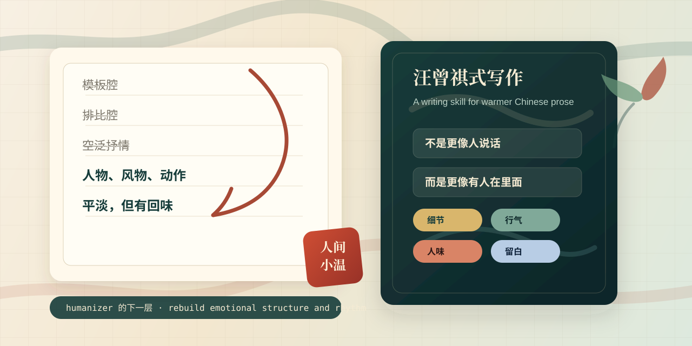

# WangZengqi-Writing-Style



[中文 README](./README.md)

> Not another `humanizer-zh`.  
> This is a writing skill for the problem that remains **after** you remove the obvious AI smell: the text is still emotionally flat, weightless, and without human texture.

## What problem does this solve?

Many Chinese writing humanizers and anti-AI-style prompts can already help with:

- template-like phrasing
- over-structured output
- generic “first / second / finally” flow
- obvious ChatGPT vocabulary habits
- shallow polished-but-robotic tone

But after that cleanup, a harder problem usually remains:

**The text is less fake, but still empty.**

It sounds more natural, yet it still does not feel like it was written by someone who has actually lived through a scene, remembered its details, and cared about what it meant.

Typical symptoms:

- smoother sentences, but no emotional anchor
- more natural wording, but no people, objects, weather, or place
- readable Chinese, but no breath, no rhythm, no aftertaste
- less AI-ish, but not more alive

This repository is built for that exact gap.

It does not just swap words to sound more natural. It pushes writing toward:

- more people
- more concrete detail
- more objects and atmosphere
- more lived texture
- more movement between sentences
- more restraint, but also more feeling

In short, this project is not asking:

**“Does this sound less like AI?”**

It asks:

**“Does this feel like it was written by a person who has actually lived?”**

## Why a normal humanizer is not enough

Most humanizer skills are strong at surface-level de-AI-fication:

- word replacement
- structure randomization
- removing template feel
- avoiding high-frequency AI patterns

Useful, yes. But that only solves the first layer.

The harder layer is:

1. where emotion should land
2. where details should come from
3. how one sentence should carry breath into the next
4. what should stay unsaid
5. how to write “plain” without becoming “flat”

Wang Zengqi offers not a decorative style, but a deeper writing mechanism:

- `write close to the character`
- `let emotion live inside details and atmosphere`
- `keep the prose plain, but full of internal movement`
- `let refined Chinese and living spoken texture nourish each other`
- `treat language as the substance, not the wrapper`

That is why this project is better understood as:

**the layer after a humanizer.**

Not just “make it sound human,” but “make it feel inhabited.”

## How this skill works

This skill does not begin by beautifying language.

It first checks the deeper structural problems in a paragraph, Wang Zengqi-style:

### 1. Look at object and atmosphere

- who is being written
- where the scene happens
- what season or time it belongs to
- whether there are concrete objects, food, tools, streets, plants, weather

### 2. Look at people and relationships

- whether there are actual people in the text
- whether gestures, forms of address, or habits reveal relationships
- whether the narrator speaks too much while the people stay lifeless

### 3. Look at sentence movement

- whether sentences are too evenly shaped
- whether the paragraph is only stacked information
- whether it reads “smooth” but not alive

### 4. Look at emotional restraint

- whether emotion is directly declared
- whether it can be moved into objects, pauses, movement, and setting

Only after that does the rewriting begin.

So the goal is not cosmetic polishing, but **rebuilding the emotional structure and breathing rhythm of the text**.

## Why it is worth using

If you have tried many Chinese writing skills, you may already know the split:

- some tools make the writing look better
- some tools make the writing feel inhabited

This one aims for the second.

It is especially useful if:

- you write posts, essays, scripts, or long-form content and want less AI smell
- you write memory pieces, portraits, life writing, or emotionally grounded content
- you are building an AI writing product and want to go beyond “anti-AI tone”
- you already use `humanizer-zh`-style tools but still find the result emotionally thin
- you want prose that is not more ornate, but more alive

It does not try to force every paragraph into imitation-Wang-Zengqi mode.

Its deeper value is teaching an agent to:

- preserve the part of the text that carries lived reality
- find the detail that should actually be written
- remove explanation and empty lyrical statements
- place feeling onto things, instead of slogans

## Quick start

### Option 1: Use it as a Codex / Claude Code skill

After placing the directory into your skill path, trigger it with prompts such as:

```text
Rewrite this in Wang Zengqi's style.
```

```text
This paragraph no longer sounds obviously AI-generated, but it still has no feeling. Use wang zengqi perspective to push it one layer further.
```

```text
Rewrite this like someone who has actually lived through the scene, not just surface-level humanization.
```

### Option 2: Chain it with `humanizer-zh`

Recommended workflow:

1. Use `humanizer-zh` to remove obvious template feel and AI tone
2. Use this skill to fix the deeper problem: no emotion, no human texture, no breathing rhythm

Example chained prompt:

```text
First use humanizer-zh to remove obvious AI tone, then use wang-zengqi-perspective to rewrite it:
1. Keep the original meaning
2. Add people, atmosphere, and concrete detail
3. Do not declare emotion directly; let it land in scene and action
4. Keep the prose plain, but full of movement
```

### Option 3: Use it as a prompt asset or system prompt

If your agent does not support native skills, you can still use [`SKILL.md`](./wangzengqi-perspective/SKILL.md) as:

- a system prompt
- a persona prompt
- a writing copilot spec
- a rewrite policy

for any personal agent with enough context length.

## Compatibility with Claude Code, Codex, and other personal agents

This repository is fundamentally a **plain Markdown writing skill / prompt asset**, so it is portable across tooling.

### Claude Code

- usable as a local skill
- easy to chain with other Chinese writing skills
- suitable for rewriting, style repair, continuation, and emotional grounding

### Codex / Codex App

- can be used as a persona or writing protocol
- if your environment supports skill directories, it can be plugged in directly
- otherwise, the full `SKILL.md` can be used as a high-priority prompt

### Other personal agents

Works well for any agent that supports:

- system prompts or developer prompts
- long context
- multi-turn rewriting
- rule-based rewrite workflows

Including but not limited to:

- Claude Desktop / Claude with custom instructions
- OpenAI-compatible personal agents
- local agent frameworks
- custom writing copilots

In other words:

**this repository is not selling a platform-specific integration. It is selling a portable Chinese writing strategy.**

## Example: what kind of rewrite it pushes toward

It does not aim to make sentences more ornamental.

It prefers a shift like this:

### Before

> That day I returned to my hometown and felt deeply emotional. Many years had passed, but everything there still made me feel warm.

### After

> When the car reached the town entrance, the first thing I saw was the flatbread shop. The stove was still outside the door. The fire was small, but the sesame smell was the same as before. The street seemed a little wider now, with fewer people. I stood there for a while after getting out, and only then remembered that it had been many years since I had walked back like this.

The point is not “more beautiful.”

The point is:

- emotion is not announced directly
- warmth is not declared as a conclusion
- feeling lands on the shop, the stove, the sesame smell, the street, and the pause

## Repository structure

```text
.
├── README.md
├── README.en.md
└── wangzengqi-perspective/
    ├── SKILL.md
    └── references/
        └── research/
            ├── 01-writings.md
            ├── 02-conversations.md
            ├── 03-expression-dna.md
            ├── 04-external-views.md
            ├── 05-decisions.md
            └── 06-timeline.md
```

## Research method

This is not a “style prompt” assembled from vague impressions.

It was distilled from focused study of:

- Wang Zengqi’s essays on writing and language
- self-descriptive texts
- his public reflections on fiction, language, and imagination
- high-quality critical writing and literary commentary
- timeline, creative choices, and stylistic evolution

What it extracts is not just “how to sound like Wang Zengqi,” but:

- how he observes
- how he handles people
- how he places emotion
- how he makes ordinary sentences carry taste

## Boundaries

This skill is useful, but not universal.

It is not ideal for:

- academic papers
- legal or compliance writing
- heavily structured business reporting
- technical documentation that prioritizes dense information delivery

It also cannot replace:

- real lived experience
- the author’s own power of observation
- long-term writing practice

If the original text contains no people, no scene, no objects, no gestures, no relationships, even a strong skill can only help so much.

## Who this is for

- people who want less AI smell and more human warmth in Chinese writing
- people already using `humanizer-zh` but still unsatisfied
- builders of Chinese AI writing tools and personal agents
- prompt engineers who want to move from “natural” toward “alive”

## Credits and sources

The [`SKILL.md`](./wangzengqi-perspective/SKILL.md) file and research notes were compiled from public materials, mainly including:

- articles from China Writers Association sources
- The Paper’s compiled Wang Zengqi essays and statements
- Tsinghua alumni publication of “Self-Introduction”
- related essays from Guangming Daily

See [`references/research`](./wangzengqi-perspective/references/research) for the detailed research trail.

## License

No standalone license has been declared yet. If you plan to encourage forks, remixing, or commercial integration, adding a `LICENSE` file is strongly recommended.

⚠️ The content above still contains placeholders / example data that should be replaced with your real data if needed: current `License` status, actual installation paths in your agent environment, and any final external-facing product positioning copy.
